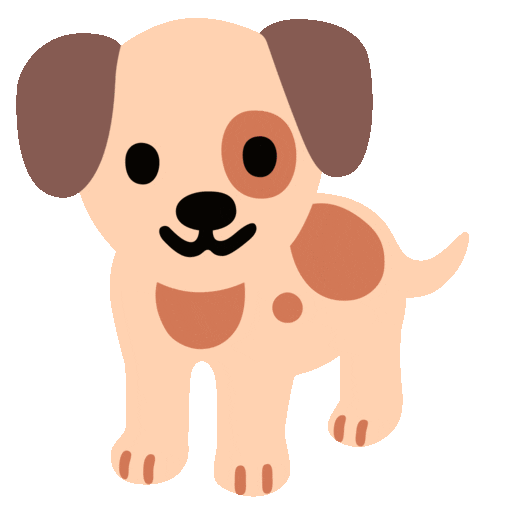

## Hi, I'm Sarah! 

<h3>About Me</h3>
<h4>currently learning</h4>
<ul>
  <li>HTML</li>
  <li>CSS</li>
  <li>Javascript</li>
  <li>VisualBasic</li>
  <li>FreePascal</li>
</ul>

I also have a dog his name is Toby and he is a german shepherd mix 
<!--
-->
<h3 align="center">A passionate frontend developer from India</h3>

  

<h3 align="left">Connect with me:</h3>

<h3 align="left">Languages and Tools:</h3>

                   

&nbsp;

